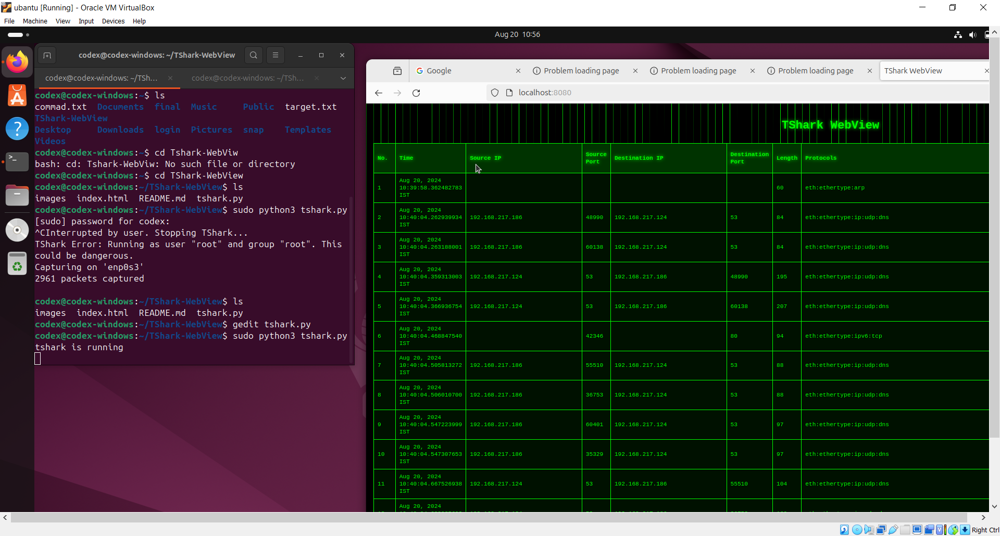

# TShark WebView

TShark WebView is a web-based GUI for TShark, designed to simplify packet analysis and visualization. This tool provides an intuitive interface for capturing and analyzing network traffic.

## Features
- Real-time packet capture and analysis
- User-friendly web interface
- Detailed packet breakdown
- Export results in various formats

## Installation

1. Clone the repository:
    ```bash
   https://github.com/khilesh114/TShark-WebView
    ```
2. Navigate to the project directory:
    ```bash
    cd TShark-WebView
    ```
3. Install dependencies:
    ```bash
    sudo apt install tshark
    sudo apt install php
    ```
4. Start the application:
    ```bash
    sudo python3 tshark.py
    ```
5. open Your second tab terminal and run
   ```bash
    cd path/to/TShark-WebView
    php -S localhost:8080

    ```
   
## Usage

Simply open your browser and navigate to `http://localhost:8080` to start capturing and analyzing network packets.

## Screenshots



## Demo Video

[Watch the demo video](https://www.youtube.com/watch?v=9vz88H8fuhE)

